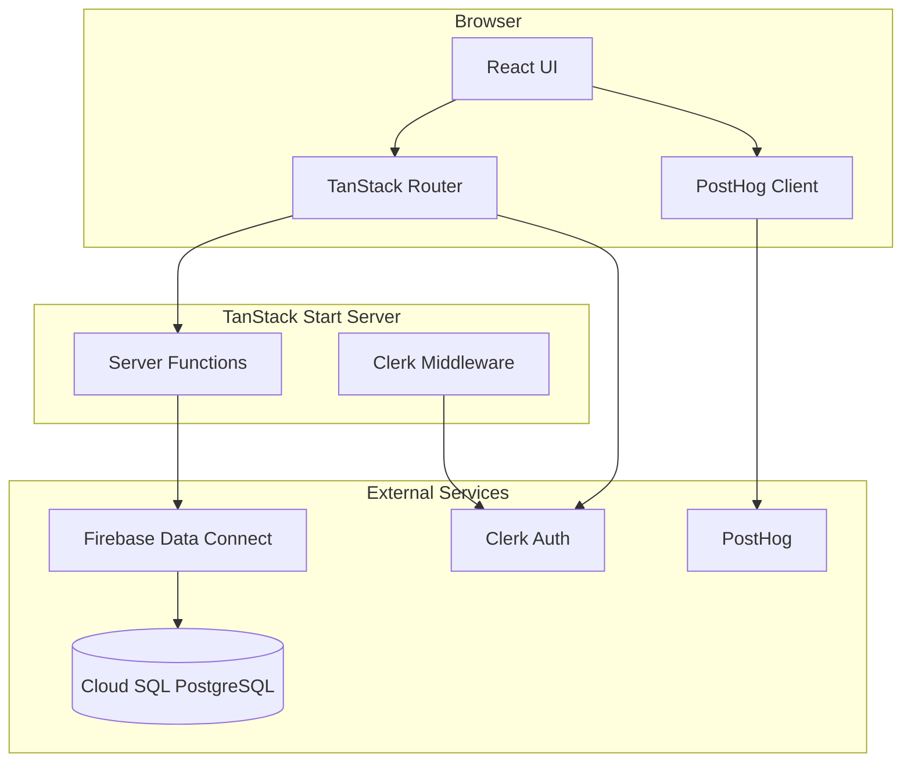

# SkilledAgent

SkilledAgent is a registry for procedural agent skills — reusable capabilities that coding agents can discover, install, and run. The app provides a route-driven workspace where authors publish skills and users browse a live catalog backed by a PostgreSQL database.

## What it does

- **Browse skills** — The home page loads the most recently created skills from the database and renders them as interactive cards with install commands, tags, and author metadata.
- **Authenticate users** — Clerk handles sign-in and sign-up. Signed-in users are identified in PostHog for product analytics.
- **Publish skills** *(in progress)* — The data model and Firebase Data Connect schema support skill creation; dedicated `/skills` and `/skills/new` routes are linked from the UI but not yet implemented.

Each skill record includes a title, description, tags, install command, prompt configuration, usage example, and a relationship to the authoring user.

## Architecture



### Request flow (home page)

1. The `/` route loader calls a TanStack Start **server function** (`getSkillsFn`).
2. The server function invokes the generated **Firebase Data Connect** SDK (`getSkills`).
3. Data Connect runs the `GetSkills` GraphQL query against **PostgreSQL** (Cloud SQL in production, PGlite emulator locally).
4. Results are passed to the route component, which renders `SkillCard` components.

Authentication runs through **Clerk middleware** on the server (`src/start.ts`) and **ClerkProvider** in the root layout. Data Connect queries used on the home page are public; future write operations will require authenticated access levels in the connector.

### Tech stack

| Layer | Technology |
| --- | --- |
| Framework | [TanStack Start](https://tanstack.com/start) (SSR React) |
| Routing | [TanStack Router](https://tanstack.com/router) (file-based) |
| Data fetching | Route loaders, server functions, [TanStack Query](https://tanstack.com/query) |
| Auth | [Clerk](https://clerk.com) via `@clerk/tanstack-react-start` |
| Database | [Firebase Data Connect](https://firebase.google.com/docs/data-connect) → PostgreSQL |
| Analytics | [PostHog](https://posthog.com) (client + server SDKs) |
| Styling | [Tailwind CSS v4](https://tailwindcss.com), [shadcn/ui](https://ui.shadcn.com) |
| Tooling | Vite, TypeScript, Biome, Vitest |

## Project structure

```
skilled-agent/
├── src/
│   ├── routes/                  # File-based routes
│   │   ├── __root.tsx           # App shell, providers, layout
│   │   ├── index.tsx            # Home page (skill listing)
│   │   └── __auth/              # Clerk sign-in / sign-up pages
│   ├── components/              # UI (Navbar, SkillCard, Crosshair)
│   ├── lib/
│   │   └── firebase.ts          # Firebase app + Data Connect client
│   ├── integrations/
│   │   └── tanstack-query/      # Query client setup
│   ├── dataconnect-generated/   # Auto-generated Data Connect SDK (do not edit)
│   ├── start.ts                 # TanStack Start config + Clerk middleware
│   └── router.tsx               # Router factory
├── dataconnect/
│   ├── schema/schema.gql        # User and Skill table definitions
│   ├── connectors/queries.gql   # GetSkills query exposed to the app
│   └── dataconnect.yaml         # Service and Cloud SQL configuration
├── firebase.json                # Firebase emulator config
└── vite.config.ts               # Vite + PostHog dev proxy
```

## Data model

Firebase Data Connect defines two tables in `dataconnect/schema/schema.gql`:

**User** — keyed by Clerk ID

- `clerkId`, `email`, `username`, `imageUrl`

**Skill** — authored by a user

- `id`, `title`, `description`, `tags`
- `installCommand`, `promptConfig`, `usageExample`
- `createdAt`, `author` (→ User)

The `GetSkills` query in `dataconnect/connectors/queries.gql` searches by title/description, orders by `createdAt DESC`, and is exposed at `@auth(level: PUBLIC)` so the catalog is readable without signing in.

After changing the schema or connectors, regenerate the client SDK:

```bash
firebase dataconnect:sdk:generate
```

## Routes

| Path | Description |
| --- | --- |
| `/` | Home — hero, browse/publish CTAs, recently created skills |
| `/sign-in/*` | Clerk sign-in |
| `/sign-up/*` | Clerk sign-up |

Planned routes referenced in the UI: `/skills` (full registry), `/skills/new` (publish flow).

## Getting started

### Prerequisites

- Node.js 18+
- [Firebase CLI](https://firebase.google.com/docs/cli) (for Data Connect emulator and SDK generation)
- Clerk application
- Firebase project with Data Connect enabled

### Install and run

```bash
npm install
npm run dev
```

The dev server starts on port 3000.

### Environment variables

Copy `.env.example` to `.env.local` and fill in the values:

```bash
# Clerk
VITE_CLERK_PUBLISHABLE_KEY=pk_test_...

# Firebase (from Firebase console → Project settings)
VITE_FIREBASE_API_KEY=
VITE_FIREBASE_AUTH_DOMAIN=
VITE_FIREBASE_PROJECT_ID=
VITE_FIREBASE_APP_ID=

# PostHog
VITE_PUBLIC_POSTHOG_PROJECT_TOKEN=
VITE_PUBLIC_POSTHOG_HOST=https://us.posthog.com   # optional
```

Clerk also requires a secret key for server-side middleware. Set `CLERK_SECRET_KEY` in your environment following the [Clerk TanStack Start docs](https://clerk.com/docs/quickstarts/tanstack-start).

### Firebase Data Connect (local)

Start the Data Connect emulator alongside the app:

```bash
firebase emulators:start --only dataconnect
```

The emulator uses PGlite data stored under `dataconnect/.dataconnect/pgliteData`. Seed or inspect data with the `.gql` operation files in `dataconnect/` (e.g. `Skill_insert.gql`, `User_insert.gql`).

## Development

```bash
npm run dev          # Start dev server (port 3000)
npm run build        # Production build
npm run preview      # Preview production build
npm run test         # Run Vitest tests
npm run lint         # Biome lint
npm run format       # Biome format
npm run check        # Biome lint + format
```

### Adding shadcn components

```bash
pnpm dlx shadcn@latest add button
```

### PostHog in development

Vite proxies `/ingest` requests to PostHog so analytics work locally without CORS issues. Event captures include `browse_registry_clicked`, `publish_skill_clicked`, `install_command_copied`, `skill_card_opened`, and auth page views.

## Deployment

- **Frontend** — Build with `npm run build` and deploy the TanStack Start output to your hosting target (Firebase App Hosting, Vercel, etc.).
- **Database** — Deploy the Data Connect schema and connectors to the Firebase project (`skilledagent-31537`):

  ```bash
  firebase deploy --only dataconnect
  ```

- **Secrets** — Use production Clerk and Firebase credentials. Replace PostHog test tokens with production project tokens.

## Learn more

- [TanStack Start](https://tanstack.com/start)
- [Firebase Data Connect](https://firebase.google.com/docs/data-connect)
- [Clerk + TanStack Start](https://clerk.com/docs/quickstarts/tanstack-start)
